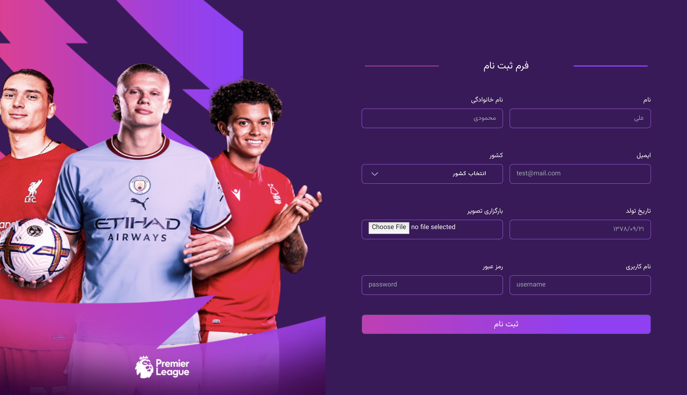
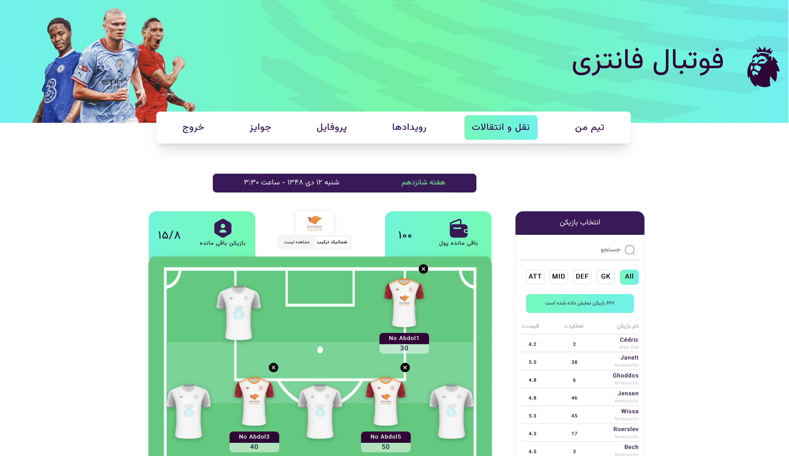
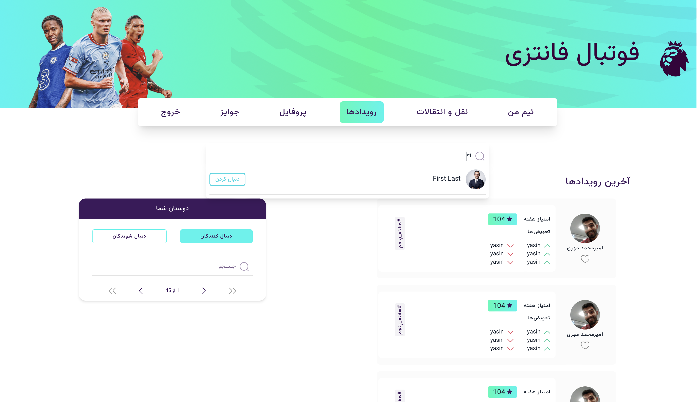
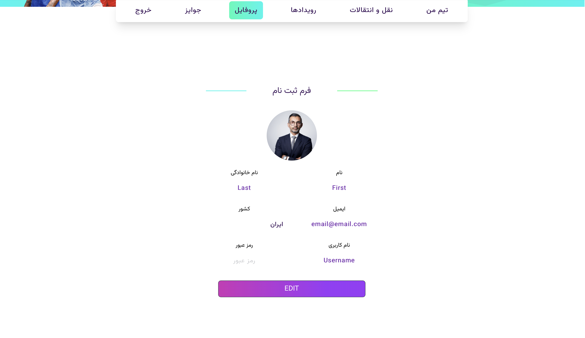

# Football fantasy premier league frontend project developed using React

This project was bootstrapped with [Create React App](https://github.com/facebook/create-react-app).
</br>
You can use [fpl_backend_nest](https://github.com/moAmza/fpl_backend_nest) or [fpl_backend_express](https://github.com/moAmza/fpl_backend_express) as the backend server and run the application.
</br></br></br>

## Running the app

```bash
# development
$ npm start

# build the application
$ npm run build
```

</br></br></br>

## Some shots from the application

</br>





</br></br></br>

## Stay in touch

- Author - [Mohamad A. Zangooei](https://github.com/moAmza)
- Phone - +989150035325

</br></br></br>
